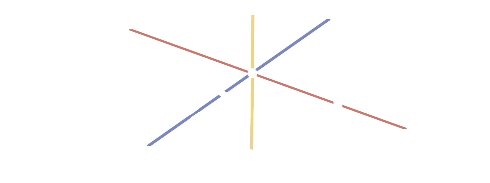

## About:
Point is a toy 3D game engine created by Taylor Wolff as their undergraduate capstone project.

## Features:
* A 3D renderer with [OpenGL](https://www.opengl.org)
* Window/Input management with [SDL3](https://libsdl.org)
* Custom materials system with shader compilation.
* A custom resource manager for caching textures/materials.
* gltf/glb model loading with [Assimp](https://www.assimp.org)
* A custom entity component system using the sparse/dense set design pattern.
* Fast mathematics with the [OpenGL Mathematics Library (GLM)](https://github.com/g-truc/glm)
* Native C++ scripting.

## Installation:
You can install the engine by cloning the repository as a zip file and then extracting all of it's contents.

## Building:
The engine uses the [CMake](https://cmake.org) build system for portable building across architectures. Currently building for the engine has only been tested on an x86 Intel CPU with Windows 11. Other architectures will be tested soon, but no other OS is planned to be supported. To build the project just build the target "Point-Engine.exe". If any packages aren't found automatically then CMake's fetch command will retrieve them.

## Assets
All distributed assets for the engine are licensed under creative commons licenses:

Utah teapot model:
https://sketchfab.com/3d-models/the-utah-teapot-1092c2832df14099807f66c8b792374d

Grass texture:
https://flic.kr/p/3irSi4

Dirty metal texture:
https://flic.kr/p/bcCbkX

## Learning Resources

Learn OpenGL
https://learnopengl.com

Dr. Mike Shah's "introduction to OpenGL" video series
https://youtube.com/playlist?list=PLvv0ScY6vfd9zlZkIIqGDeG5TUWswkMox&feature=shared

Fundamentals of Computer Graphics by Marschner and Shirley
https://www.taylorfrancis.com/books/edit/10.1201/9781003050339/fundamentals-computer-graphics-peter-shirley-steve-marschner

